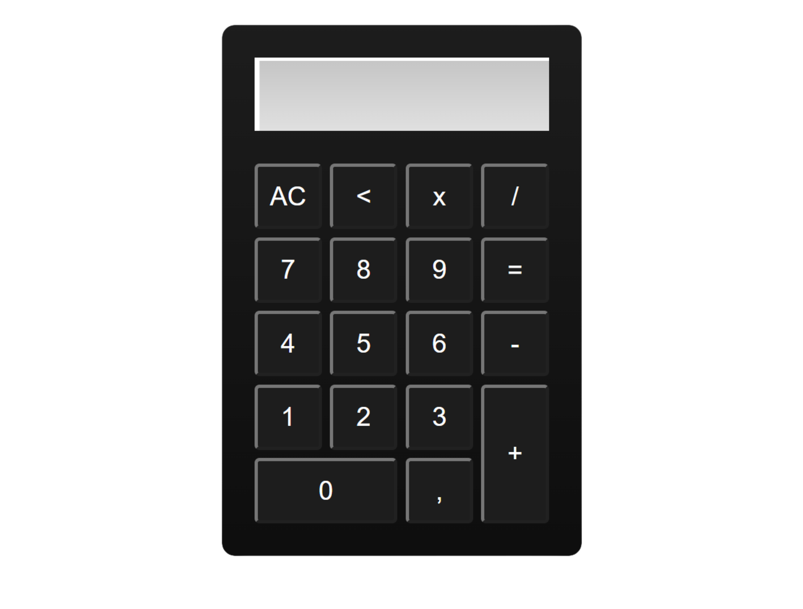
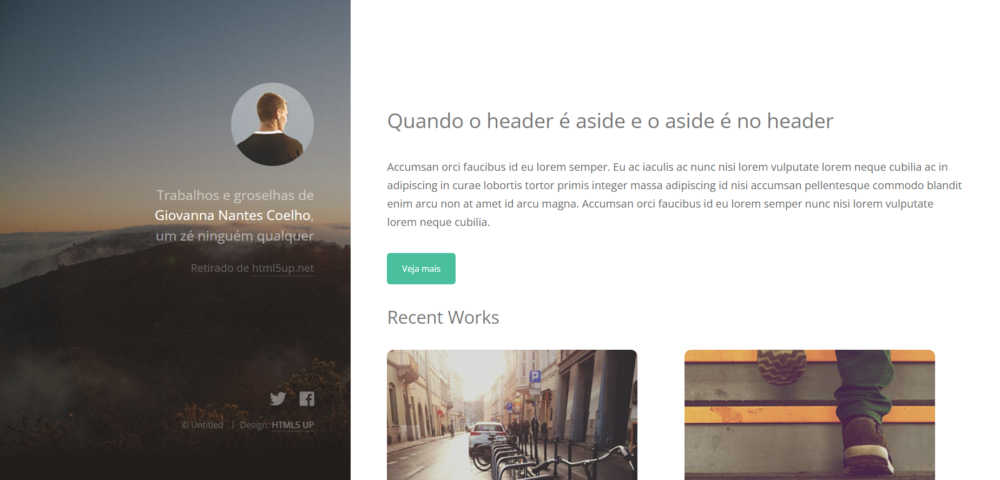

# Web-Design-Completo
Hiii, I created this repository to organize my projects developed in the Webdesign/Front-end Fundamentals Course (Basic to Advanced) at Udemy.

In these projects were applied several concepts of HTML and CSS, focusing mainly on the correct use of the semantics of these technologies. 

Link to purchase the course: https://www.udemy.com/course/curso-web-design-fundamentos-aprenda-html-css-e-javascript/

<h3>Calculator (HTML + CSS + pure JS)</h3>

<h3>Infusion (HTML + CSS + pure JS)</h3>

 
<h3>Strata (HTML + CSS + pure JS on forms)</h3>

 
<img src="ProjetoRangeHotels.png"
